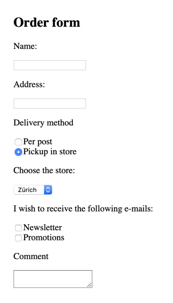

# Lab 6 - Forms

1. Run `yarn && yarn serve` inside this folder. Open the website and see that the application is loaded. 
1. In your IDE, open the `src` folder and explore the code. We are taking a break from our cocktail app to practice forms!
1. "Data preview" section of the template is provided for you and will display the values, entered through the form you're about to create.
Here's how the form is supposed to look like:

    

1. And here are the requirements:

        - 'Name' and 'Address' are text fields
        - 'Delivery method' can have a value of either 'POST' or 'PICKUP'
        - 'Choose the store' section is only displayed if user selects a 'Pickup in store' option as a delivery method.
        - For the store dropdown let's use 'ZURICH', 'LONDON' and 'BERLIN' values.
        - For checkboxes let's use 'NEWSLETTER' and 'PROMOTIONS' values correspondingly
        - Comment is a multi-line text

    <details>
    <summary>Hint</summary>
    
    We can use a `.lazy` modifier to only update the model once the user clicks out of the input field.
    
    ```vue
    <template>
      <div id='app'>
        <section>
          <h1>Order form</h1>
          <div>
            <p><label for="inputName">Name:</label></p>
            <input type="text" id="inputName" v-model="name">
          </div>
          <div>
            <p><label for="inputAddress">Address:</label></p>
            <input type="text" id="inputAddress" v-model="address">
          </div>
          <div>
            <p>Delivery method</p>
            <div>
              <input type="radio" id="deliveryPost" v-model="deliveryMethod" value="POST">
              <label for="deliveryPost">Per post</label>
            </div>
            <div>
              <input type="radio" id="deliveryPickup" v-model="deliveryMethod" value="PICKUP">
              <label for="deliveryPickup">Pickup in store</label>
            </div>
            <div v-if="deliveryMethod === 'PICKUP'">
              <p><label for="inputStore">Choose the store:</label></p>
              <select id="inputStore" v-model="store">
                <option value="ZURICH">Zürich</option>
                <option value="LONDON">London</option>
                <option value="BERLIN">Berlin</option>
              </select>
            </div>
          </div>
          <div>
            <p>I wish to receive the following e-mails:</p>
            <div>
              <input type="checkbox" id="emailTypeNewsletter" v-model="emailTypes" value="NEWSLETTER">
              <label for="emailTypeNewsletter">Newsletter</label>
            </div>
            <div>
              <input type="checkbox" id="emailTypePromotions" v-model="emailTypes" value="PROMOTIONS">
              <label for="emailTypePromotions">Promotions</label>
            </div>
          </div>
          <div>
            <p>Comment</p>
            <textarea v-model="comment"></textarea>
          </div>
        </section>
        ....
      </div>
    </template>
    ```
    </details>

1. Once you're done, test your form by filling in the data and seeing the result in the "Data preview" section.
Try adding some leading or trailing spaces to the `Name` field and see that they are preserved.
Normally we don't want this kind of spaces to be sent to our back end. How can we easily trim the text value?

1. Did you notice how data preview updates while you type
 Sometimes we don't want this behaviour, and would prefer to only update the model value, once the user leaves the field. 
Let's simulate such use-case and add a zip-code field. Valid values should consist of numbers only and be 4 symbols long.
Here's a code you can use:

    ```vue
    <template>
      ....
      <div>
        <p><label for="zip">Zip code:</label></p>
        <input type="text" id="zip" v-model="zip">
        <span v-if="zip && !isZipValid">Please enter a valid zip code</span>
      </div>
    </template>
    
    <script>
      export default {
        data() {
          return {
            ....
            zip: undefined
          }
        },
        computed: {
          isZipValid() {
            return RegExp(/^[0-9]{4}$/).test(this.zip);
          }
        }
      }
    </script>
    ```

1. Now do you notice how validation error is displayed when you are still typing? Speaking of annoying user experience!
What can we do to prevent this? How can we make sure validation is only done once user is done typing?

    <details>
    <summary>Hint</summary>
    
    We can use a `.lazy` modifier to only update the model once the user clicks out of the input field.
    
    ```vue
    <template>
      ....
      <div>
        <p><label for="zip">Zip code:</label></p>
        <input type="text" id="zip" v-model.lazy="zip">
        <span v-if="zip && !isZipValid">Please enter a valid zip code</span>
      </div>
    </template>
    ```
    </details>
