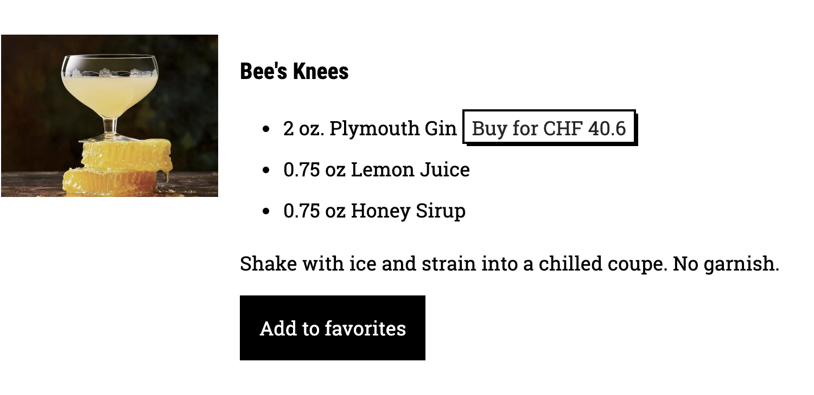
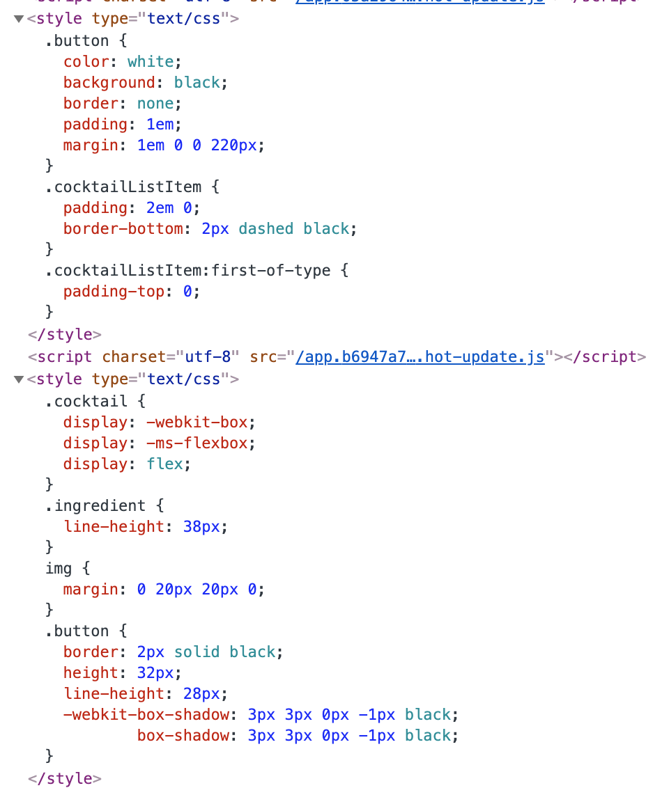
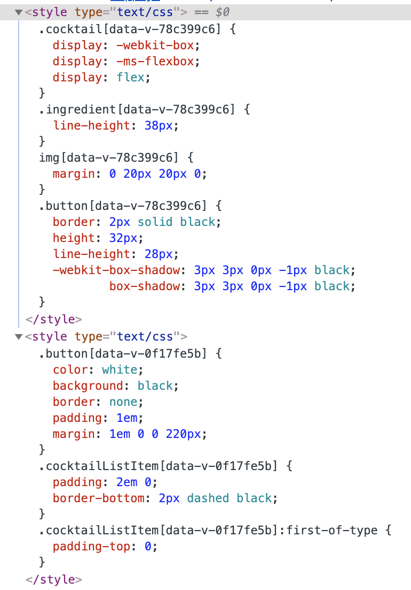
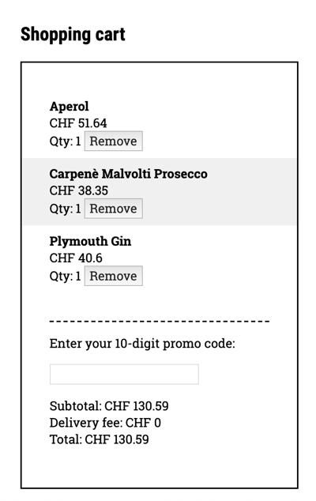
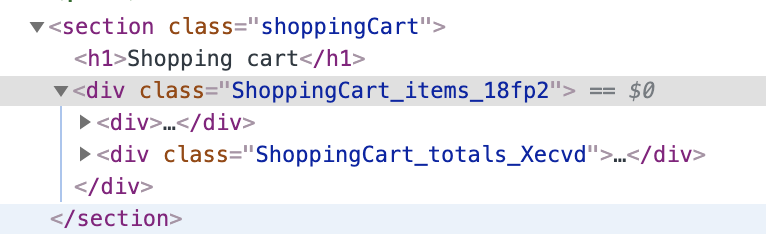

# Lab 7 - CSS

1. Run `yarn && yarn serve` inside this folder.
Open the website and see that the application is loaded.
Looks like some CSS fairy dust got sprinkled over our app, but what else has changed?

    <details>
    <summary>Hint</summary>
    
    What was added:
    - styling
    - navigation switching between "All recipes" and "Favorite recipes" section
    - buttons to remove products from the cart
    - buttons to remove recipes from favorites
    </details>

1. In your IDE, open the `src` folder and explore the code. Note which components got new styles, see how new functionality is implemented.
1. A UX designer has pointed out that we forgot to style the add to cart buttons for the ingredients.
Here is the design:

    

    They were also kind to provide us with the styles:
    
    ```css
    .button {
      border: 2px solid black;
      height: 32px;
      line-height: 28px;
      box-shadow: 3px 3px 0px -1px black;
    }
    ```
    
    So let's go to the `Cocktail.vue` component, paste this CSS snippet into the style section and add a class to the button.
    
    <details>
    <summary>Hint</summary>
    
    ```vue
    <template>
      ....
      <button
        v-if="ingredient.price"
        @click="$emit('ingredientClick', ingredient)"
        class="button">
        Buy for CHF {{ ingredient.price }}
        </button>
     ....
    </template>
    
    ....
 
    <style>
      ....
    
      .button {
        border: 2px solid black;
        height: 32px;
        line-height: 28px;
        box-shadow: 3px 3px 0px -1px black;
      }
    </style>
    ```
    </details>

1. Well, that didn't work. Can you spot the problem? How does the resulting CSS look like in the developer tools?

    <details>
    <summary>Hint</summary>
    
    It appears that there is a CSS class with the same name already in another component.
    
    `CocktailList.vue`
    
    ```vue
    <button
      v-if="displayAddToFavoritesButton"
      @click="$emit('cocktailClick', cocktail)"
      class="button">
      Add to favorites
    </button>
    ```    
    
    And here's how resulting CSS looks like:
    
    
    See that both instances of the `.button` style declarations are there. So they both apply!
    </details>    
    
1. Let's use scoped CSS to fix this.
Note that when you switch between CSS modes in Vue application, you might need to refresh the page manually or even restart the website.
We will learn why this is necessary in the section about Vue.js developer tooling.

    <details>
    <summary>Hint</summary>
    
    We need to add `scoped` attribute to the style sections in all components, that have a clashing class.
    (`CocktailList.vue` and `Cocktail.vue`)
    
    ```vue
    <style scoped>
    ....
    </style>
    ```    
    </details>
    
1. Looks better? Try inspecting the code in browser to see how resulting CSS looks like now.

    <details>
    <summary>Hint</summary>
    
    In a scoped mode Vue automatically adjusts our selectors to include unique autogenerated data attributes.
    Scoped styles won't leak!
     
    </details>
    
1. Now let's add several different ingredients to the shopping cart.
Optically, it gets a little bit crowded and our designer has suggested to apply a grey background to every second item, like this:

    

    We could of course add the style to the `ShoppingCartItem.vue` component and conditionally apply it based on the property value.  
    But what if the design of `ShoppingCartItem` keeps changing based on which context it is used?  
    Our component will start having tons of different properties and contain CSS, that doesn't really belong in the `ShoppingCartItem`.  
    The better way would be to pass the class from the parent component, that has the context, to the child.  
    And we know it's easy to do using module CSS.

1. Let's start by switching `ShoppingCart` to the module CSS mode. Once done, take a look in the browser at what happens to the code.

    <details>
    <summary>Hint</summary>
    
    ```vue
    <template>
      <section>
        <h1>Shopping cart</h1>
        <div :class="$style.items">
          <div v-if="hasItems">
            ....
          </div>
          <div v-if="hasItems" :class="$style.totals">
            ....
          </div>
          ....
        </div>
      </section>
    </template>
    
    <style module>
    .items {
      padding: 40px;
      border: 2px solid black;
    }
    
    .items ul {
      list-style-type: none;
      padding: 0;
      margin: 0 -40px;
    }
    
    .totals {
      margin-top: 40px;
      border-top: 2px dashed black;
    }
    </style>
    ```
    
    In a browser we will see, that our classes got prefixed with the component name and suffixed with unique hash.  
    No leaking can happen AND we know which component the class belongs too.
    
    
    
    </details>
    
1. Now let's declare this class in the `ShoppingCart` component and apply it to every second `ShoppingCartItem` instance we render in the loop.  
    
    ```css
        .evenShoppingListItem {
          background: #f0f0f0;
        }
    ```   
    
    Pro tip: you can also use index while iterating through the object with the v-for!
    
    ```vue
     <li v-for="(value, key, index) in items">
        ....
     </li>
    ```
    
    <details>
    <summary>Hint</summary>
    
    `ShoppingCart.vue`
    
    ```vue
    <template>
     ....
      <li v-for="(data, title, index) in items">
          <ShoppingCartItem
            :title="title"
            :price="data.price"
            :quantity="data.quantity"
            :skin="(index % 2 === 1) ? $style.evenShoppingListItem : ''">
          </ShoppingCartItem>
      </li>
      ....
    </template>
    
    <style module>
    ....
    
    .evenShoppingListItem {
      background: #f0f0f0;
    }
    </style>
    ```
    
    `ShoppingCartItem.vue`
        
    ```vue
    <template>
      <div :class="[$style.item, skin]">
        <strong>{{ title }}</strong> <br />
        CHF {{ price }} <br />
        Qty: {{ quantity }}
        <button @click="$emit('removeItem', title)">Remove</button>
      </div>
    </template>
    
    <script>
      export default {
        props: {
          ....
          skin: String
        }
      }
    </script>
    
    <style module>
      .item {
        padding: 10px 40px;
      }
    </style>
    ```
    </details>
    
### Bonus track

Use your favorite CSS pre-processor or postCSS and refactor the styles to use variables instead of hardcoded values.
