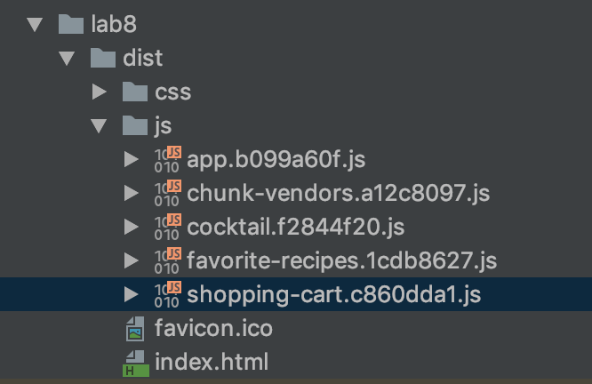

# Lab 8 - Routing

1. Run `yarn && yarn serve` inside this folder.
Open the website and see that the application is loaded.
Oh, a lot has changed - we have pages now!
Both favorites list and shopping cart are displayed on separate pages and have their own URLs.  
The design of the cocktail list has changed and the recipes are gone! But no worries, we'll fix it later.

1. In your IDE, open the `src` folder and explore the code. 
A lot has happened here as well. Let's go through the changes together.

1. Let's open `App.vue` first and see, that id doesn't contain any logic anymore.
Now there is only the navigation:
    ```vue
    <nav>
      <router-link
        to="/"
        :class="$style.navLink">
        All recipes
      </router-link>
      <router-link
        to="/favorite-recipes"
        :class="$style.navLink">
        Favorite recipes
        <span v-if="favoriteCocktailsTotal > 0">({{ favoriteCocktailsTotal }})</span>
      </router-link>
      <router-link
        to="/shopping-cart"
        :class="$style.navLink">
        Shopping cart
        <span v-if="shoppingCartItemsTotal > 0">({{ shoppingCartItemsTotal }})</span>
      </router-link>
    </nav>    
    ```
    
    and a `<router-view>` component, that will render our views.
    
1. Now let's explore `router.js` - this is where our paths are defined and mapped to view components.
Note that the component for the main path is loaded normally, but two others are injected using webpack's dynamic import.
This means that the code necessary for these components will be loaded lazily only when the user actually decides to go visit that route.
To test this, stop serving the application and run `yarn build` in the `lab8` directory.
A `dist` folder with production build will appear.
Explore it, it's structure should look similar to this:

    

    See how there are several *.js files - each of them, except `app` and `chunk-vendors` contains code for just one route.
    
1. Folder structure has changed as well - now all view components are in `view` directory, and all others are in `components` folder.

1. Since `App.vue` doesn't contain any logic anymore, our global data storage (the lists of favorites and shopping cart items) has been moved into global variables and now resides in `main.js`.
We can reference these variables by accessing application root like this `$root.favoriteCocktails`, which is clearly not ideal.
We will learn how to fix this in the `State management with Vuex` chapter of this course.

1. Now let's play with the new router. Our navigation links are not highlighted, so it's difficult for the users to understand which page they are currently on.
Let's make sure links are styled differently when their route matches the one user currently has open.
In `App.vue` there is even a CSS class `navLinkActive` made especially for that, so let's use it.

    <details>
    <summary>Hint</summary>

    ```vue
      <router-link
        to="/"
        :class="$style.navLink"
        :active-class="$style.navLinkActive">
        All recipes
      </router-link>
      <router-link
        to="/favorite-recipes"
        :class="$style.navLink"
        :active-class="$style.navLinkActive">
        Favorite recipes
        <span v-if="$root.favoriteCocktails.length > 0">
          ({{ $root.favoriteCocktails.length }})
        </span>
      </router-link>
      <router-link
        to="/shopping-cart"
        :class="$style.navLink"
        :active-class="$style.navLinkActive">
        Shopping cart
        <span v-if="Object.keys($root.shoppingCartItems).length > 0">
          ({{ Object.keys($root.shoppingCartItems).length }})
        </span>
      </router-link>
    ```
    </details>
      
1. Does this happen when you test link highlighting - you go to the shoping cart page and both `All recipes` and `Shopping cart` pages get highlighted?
Why is that? How can we fix it?

    <details>
    <summary>Hint</summary>

    We can tell router to stop using an inclusive match by using the `exact` setting on the `router-link` 
    ```vue
      <router-link
        to="/"
        :class="$style.navLink"
        :active-class="$style.navLinkActive"
        exact>
        All recipes
      </router-link>
      <router-link
        to="/favorite-recipes"
        :class="$style.navLink"
        :active-class="$style.navLinkActive"
        exact>
        Favorite recipes
        <span v-if="$root.favoriteCocktails.length > 0">
          ({{ $root.favoriteCocktails.length }})
        </span>
      </router-link>
      <router-link
        to="/shopping-cart"
        :class="$style.navLink"
        :active-class="$style.navLinkActive"
        exact>
        Shopping cart
        <span v-if="Object.keys($root.shoppingCartItems).length > 0">
          ({{ Object.keys($root.shoppingCartItems).length }})
        </span>
      </router-link>
    ```
    </details>
      
1. Now how about we have a separate page for each cocktail? So that we have enough screen real estate to display all kinds of data and really showcase that image?
In a `views` folder create a `Cocktail` component. Copy the code below into it.

    <details>
    <summary>Here's full code to save some time:</summary>
    
    `@/views/Cocktail.vue`
    ```vue
   <template>
     <div>
       <div v-if="error">
         <h1>
           Oops, something went wrong.
         </h1>
         {{error}}
       </div>
       <div v-if="cocktail">
         
         <h1>
           {{ cocktail.title }}
         </h1>
         <p>{{ cocktail.description }}</p>
         <p :class="$style.source">— {{cocktail.source}}</p>
   
         <h3>Recipe</h3>
         <ul>
           <li v-for="ingredient in cocktail.ingredients" :class="$style.ingredient">
             {{ ingredient.quantity }} {{ ingredient.title }}
             <button
                 v-if="ingredient.price"
                 @click="orderIngredient(ingredient)"
                 :class="$style.button">
               Buy for CHF {{ ingredient.price }}
             </button>
           </li>
         </ul>
         <p v-html="cocktail.method"></p>
         <SimilarCocktails :cocktail-id="cocktail.id"></SimilarCocktails>
       </div>
     </div>
   </template>
   
   <script>
     import SimilarCocktails from '@/components/SimilarCocktails';
   
     export default {
       components: {
         SimilarCocktails
       },
       data() {
         return {
           cocktail: undefined,
           error: undefined
         }
       },
       methods: {
         orderIngredient(ingredient) {
           let quantity = 1;
   
           if (this.$root.shoppingCartItems[ingredient.title]) {
             quantity = this.$root.shoppingCartItems[ingredient.title].quantity + 1;
           }
   
           this.$set(
             this.$root.shoppingCartItems,
             ingredient.title,
             {
               price: ingredient.price,
               quantity: quantity
             });
         }
       }
     };
   </script>
   
   <style module>
     .ingredient {
       line-height: 38px;
     }
   
     .image {
       max-width: 100%;
     }
  
     @media (min-width: 600px) {
       .image {
         max-width: 600px;
       }
     }
   
     .button {
       border: 2px solid black;
       height: 32px;
       line-height: 28px;
       box-shadow: 3px 3px 0px -1px black;
     }
     .source {
       text-align: right;
       font-style: italic;
     }
   </style>
    ```
    </details>

1. For our new cocktail details page, we would like to have a URL like this: `/cocktails/aperol-spritz`, where `aperol-spritz` would be a dynamic part, a cocktail ID.
Let's go and set this up in our router, mapping a path to the `Cocktail.vue` component:

    <details>
    <summary>Hint</summary>

    `router.js`
    
    ```js
      import Cocktail from './views/Cocktail.vue'
      ....
      export default new Router({
        mode: 'history',
        base: process.env.BASE_URL,
        routes: [
          ....
          {
            path: '/cocktails/:id',
            name: 'cocktail',
            component: Cocktail
          }
        ]
      })
    ```
    </details>
    
    To test, we can manually type in the `/cocktails/aperol-spritz` URL in the browser. The page will load, but display nothing. Can you tell why?

    <details>
    <summary>Hint</summary>

    Our `Cocktail` relies on the cocktail data object to be present. Currently it's set to null.
    </details>

1. Now let's adjust our `Cocktail` component so that it can fetch the cocktail data from the API.
Let's do it before navigation and use an in-component `beforeRouteEnter` guard.
Here's the code for the API call to speed things up.
The API will also throw an error if the cocktail is not found, so let's handle that.

    ```vue
    <script>
    ....
    import axios from 'axios';
    
    function getCocktailData(id) {
      return axios.get(`https://anca22974l.execute-api.eu-central-1.amazonaws.com/dev/cocktails/${id}`)
    }
 
    export default {
     ....
    }
    </script>
    ```

    <details>
    <summary>Hint</summary>

    ```vue
    <script>
      import axios from 'axios';
    
      function getCocktailData(id) {
        return axios.get(`https://anca22974l.execute-api.eu-central-1.amazonaws.com/dev/cocktails/${id}`)
      }
    
      export default {
        data() {
          return {
            cocktail: null,
            error: null
          }
        },
        async beforeRouteEnter (to, from, next) {
          let response;
          try {
            response = await getCocktailData(to.params.id);
            next(vm => vm.cocktail = response.data);
          }
          catch(error) {
            next(vm => vm.error = error);
          }
        },
        ....
      }
    </script>
    ```
    </details>

1. Now that our route is fully functioning, we link to it from the `CocktailListItem` component.  
If we do it correctly, we'll be able to land on our new route by clicking a cocktail in a list.

    <details>
    <summary>Hint</summary>

    ```vue
    <template>
      <router-link :to="{ name: 'cocktail', params: { id: cocktail.id } }" :class="$style.cocktail">
        
        <h3>{{ cocktail.title }}</h3>
        <p>{{cocktail.description}}</p>
      </router-link>
    </template>
    ```
    </details>
    
1.  Now clicking items in the `All recipes` or `Favorite recipes` sections should work. But what happens if we click one of the similar cocktails?
Looks like our `beforeRouteEnter` hook doesn't get called and the data isn't fetched. Why is that? How can we fix it?

    <details>
    <summary>Hint</summary>

    `beforeRouteEnter` hook doesn't get called, because we have already entered this very route.
    The only thing that changes when we click on a similar cocktail link is the dynamic route parameter - the `id`.
    To fetch the data when route parameter is updated, we need to provide some logic in the `beforeRouteUpdate` hook.
    This hook will already have the access to `this` context. 

    ```vue
    <script>
    ....
    export default {
      ....
      async beforeRouteEnter (to, from, next) {
        let response;
        try {
          response = await getCocktailData(to.params.id);
          next(vm => vm.cocktail = response.data);
        }
        catch(error) {
          next(vm => vm.error = error);
        }
      },
      async beforeRouteUpdate (to, from, next) {
        let response;
        this.cocktail = undefined;
        try {
          response = await getCocktailData(to.params.id);
          this.cocktail = response.data;
          next();
        }
        catch(error) {
          this.error = error;
          next();
        }
      }
      ....
    }
    </script>
    ```
    </details>

1. Clicking on similar cocktails should work now as well.
However, it would be much nicer if every page would open at the top. 
Currently it looks like the application preserves the last scroll position. Can we change that?

    <details>
    <summary>Hint</summary>
    
    `router.js`
    ```vue
    ....
    export default new Router({
      mode: 'history',
      base: process.env.BASE_URL,
      routes: [
        ....
      ],
      scrollBehavior (to, from, savedPosition) {
        return { x: 0, y: 0 }
      }
    })
    ```
    </details>

1. Another nice touch for our routing setup would be to handle all the URLs that we currently don't.
Let's redirect users that type `http://localhost:8080/gibberish` to the home page.

    <details>
    <summary>Hint</summary>
    
    ```js
    ....
    export default new Router({
      mode: 'history',
      base: process.env.BASE_URL,
      routes: [
        {
          path: '/',
          name: 'all-recipes',
          component: AllRecipes
        },
        {
          path: '/favorite-recipes',
          name: 'favorite-recipes',
          component: () => import(/* webpackChunkName: "favorite-recipes" */ './views/FavoriteRecipes.vue')
        },
        {
          path: '/shopping-cart',
          name: 'shopping-cart',
          component: () => import(/* webpackChunkName: "shopping-cart" */ './views/ShoppingCart.vue')
        },
        {
          path: '/cocktails/:id',
          name: 'cocktail',
          component: () => import(/* webpackChunkName: "cocktail" */ './views/Cocktail.vue')
        },
        {
          path: '*',
          redirect: '/'
        }
      ]
    })
    ```
    </details>

1. For the last challenge - what if for some reason, we would like to access our cocktail detail page not only by `/cocktails/gimlet` URL, but also by `/recipes/gimlet` URL?
Configure the router to allow that.

    <details>
    <summary>Hint</summary>
    
    ```js
    ....
    export default new Router({
      mode: 'history',
      base: process.env.BASE_URL,
      routes: [
        {
          path: '/',
          name: 'all-recipes',
          component: AllRecipes
        },
        {
          path: '/favorite-recipes',
          name: 'favorite-recipes',
          component: () => import(/* webpackChunkName: "favorite-recipes" */ './views/FavoriteRecipes.vue')
        },
        {
          path: '/shopping-cart',
          name: 'shopping-cart',
          component: () => import(/* webpackChunkName: "shopping-cart" */ './views/ShoppingCart.vue')
        },
        {
          path: '/cocktails/:id',
          name: 'cocktail',
          component: () => import(/* webpackChunkName: "cocktail" */ './views/Cocktail.vue'),
          alias: '/recipes/:id'
        },
        {
          path: '*',
          redirect: '/'
        }
      ]
    })
    ```
    </details>


 
